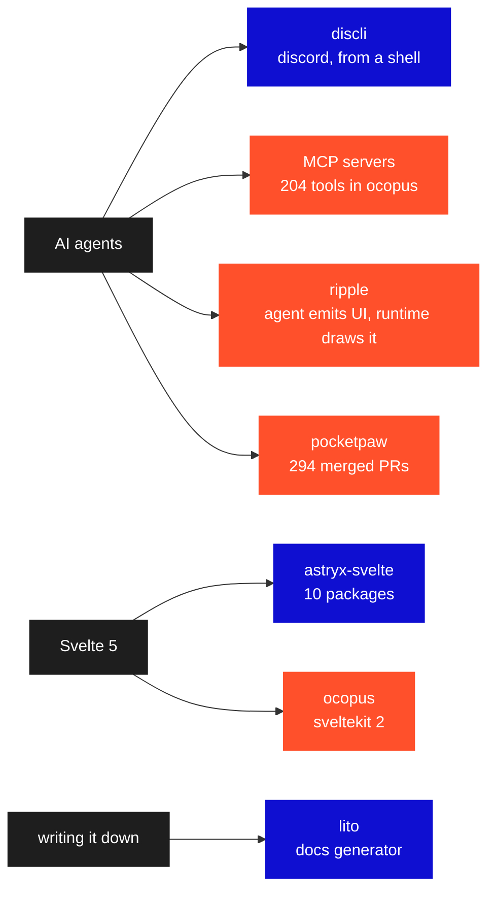

```console
rohit@github:~$ cat /proc/now

day         ripple @ qbtrix — generative UI runtime
night       ocopus — 82 models and counting
maintaining discli · astryx-svelte · lito
reading     how agents fail when they touch real systems
open to     talking about any of it
```



<sub>That diagram is plain text in the markdown file. GitHub draws it — no
image, no build step, no service to keep alive.</sub>

<p align="center">
<a href="https://github.com/DevRohit06/DevRohit06/blob/main/README.md"><code>cd ~</code></a>
&nbsp;&nbsp;·&nbsp;&nbsp;
<a href="https://github.com/DevRohit06/DevRohit06/blob/main/cmd/help.md"><code>help</code></a>
</p>
